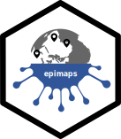

# epimaps 
<!-- badges: start -->

<!-- badges: end -->

## tldr.
GIS is one of epidemiology's bestest friends. Sadly, GIS data can also be a pain. Your shape file broke ? Bummer. None of the shape names match anything ? Ouch. The local government just restructured the administrative divisions and now all your work is useless ? Sad face.

This package doesn't really fix all those issues, but it *is* designed as a data repository of GIS data for Epicentre where the shapes and names have been vetted to match what appears in other datasets. With `epimaps` you can easily load your map data into whichever project you want and avoid constant name validation scripts that exacerbate the risk of future failure.

## countries available.
<!-- epimaps:availability -->

## adding countries.
Open an [issue](https://github.com/ceisenhauer/epimaps/issues).

